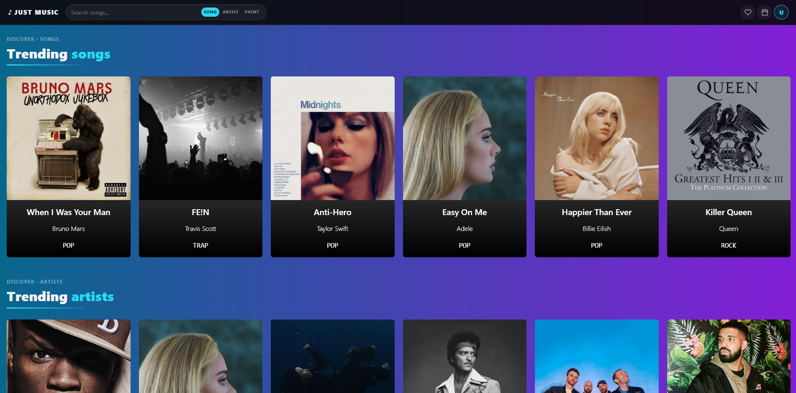
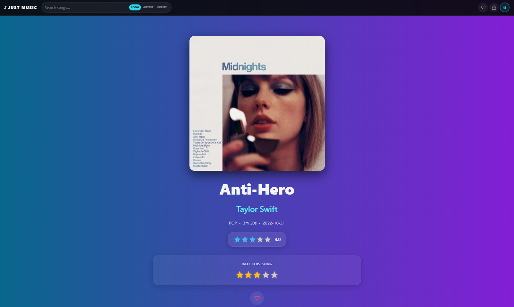
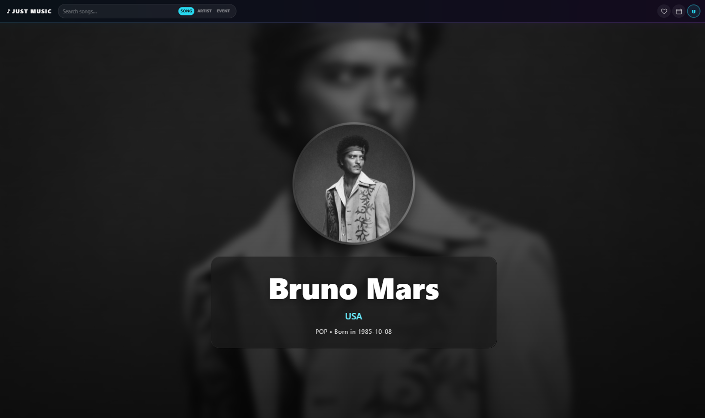
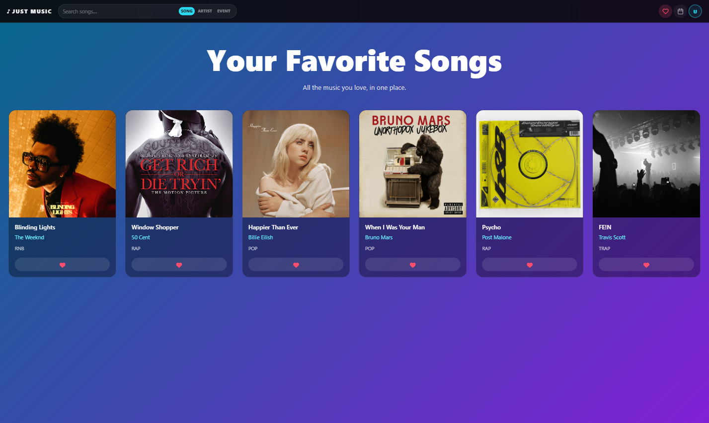

# 🎵 Just Music

Just Music is a full-stack web application built for music enthusiasts who want to discover songs, artists, and live events through a modern and engaging user experience.

The project combines a responsive React frontend with a secure Spring Boot backend, creating a complete platform where users can explore music content, manage their favorite songs, and interact with the application through a personalized rating system.

## Application Preview

### Home Page



### Song Details



### Artist Details



### Favorites



---

## About the Project

The main goal of Just Music is to provide a centralized platform where users can browse a collection of songs, artists, and music events while enjoying a smooth and intuitive interface.

Users can explore detailed information about each song, discover artists and upcoming events, save tracks to a personal favorites collection, and leave ratings through a five-star review system. Reviews contribute to an average score that helps highlight the most appreciated songs across the platform.

The application follows a secure authentication flow based on JSON Web Tokens (JWT). Access to personal features such as favorites and reviews is restricted to authenticated users, while administrative operations are protected through role-based authorization.

Throughout the development process, special attention was given to responsiveness, user experience, and clean application architecture. The interface includes dynamic content sections, loading and error handling states, reusable components, interactive carousels, and modern visual effects designed to create a polished browsing experience.

---

## Key Features

- Secure JWT Authentication
- Protected Routes
- Songs Catalog and Details Pages
- Artists Catalog and Details Pages
- Music Events Section
- Favorites Management
- Five-Star Rating System
- Average Review Calculation
- Responsive Design
- Redux State Management
- RESTful API Architecture

---

## Technologies Used

### Frontend

- React
- Redux
- React Router
- React Bootstrap
- Swiper.js
- React Icons
- CSS3

### Backend

- Java 21
- Spring Boot
- Spring Security
- JWT Authentication
- Spring Data JPA
- Hibernate
- Maven

### Database

- PostgreSQL

---

## Architecture

The application follows a classic full-stack architecture:

Frontend (React) → REST API (Spring Boot) → PostgreSQL Database

The frontend handles user interaction and state management, while the backend exposes secure REST endpoints responsible for authentication, business logic, and data persistence.

---

## Future Improvements

Several features could be introduced in future versions of the project, including:

- Playlist creation and management
- Advanced search and filtering
- Personalized music recommendations
- Real-time notifications for upcoming events
- Social features such as following artists
- Integration with external music APIs
- Audio previews for songs
- Administrative dashboard and analytics

---

## Installation

To run Just Music locally, both the frontend and backend applications must be configured and started separately.

### Frontend Setup

Clone the frontend repository:

```bash
git clone https://github.com/cicalecristian/Front-end_Capstone.git

cd Front-end_Capstone
```

Install all dependencies:

```bash
npm install
```

Start the development server:

```bash
npm run dev
```

The frontend application will be available at:

```text
http://localhost:5173
```

---

### Backend Setup

Clone the backend repository:

```bash
git clone https://github.com/cicalecristian/Back-end_Capstone.git

cd Back-end_Capstone
```

Before starting the application, create an `env.properties` file in the root directory and configure the required environment variables:

```properties
PORT=

DB_PORT=
DB_NAME=
DB_USERNAME=
DB_PASSWORD=

JWT_SECRET=

CLOUDINARY_NAME=
CLOUDINARY_API_KEY=
CLOUDINARY_API_SECRET=

MAILGUN_DOMAIN_NAME=
MAILGUN_API_KEY=
```

These variables are required for:

- PostgreSQL database connection
- JWT authentication
- Cloudinary media storage
- Mailgun email services

Make sure PostgreSQL is running and that the specified database already exists.

Start the backend application:

```bash
mvn spring-boot:run
```

The REST API will be available at:

```text
http://localhost:3001
```

---

### Database

The application uses PostgreSQL as its persistence layer.

After configuring the database credentials and starting the backend, Hibernate will automatically manage the database schema according to the project configuration.

---

### Running the Application

Once both applications are running:

1. Open the frontend in your browser.
2. Register a new account or log in.
3. Explore songs, artists, and events.
4. Save favorite songs.
5. Rate songs using the review system.

The frontend communicates with the backend through REST APIs secured with JWT authentication.

---

### Repositories

Frontend Repository:

```text
https://github.com/cicalecristian/Front-end_Capstone.git
```

Backend Repository:

```text
https://github.com/cicalecristian/Back-end_Capstone.git
```

## Author

**Cristian Cicale**

Full-Stack Web Developer passionate about building modern, scalable, and user-friendly web applications.

This project was developed to strengthen practical experience with Java, Spring Boot, React, Redux, REST APIs, JWT authentication, PostgreSQL, and modern frontend development practices.
